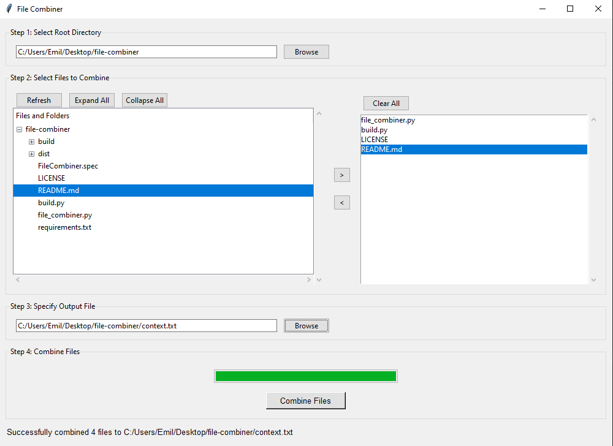

# File Combiner

A simple, user-friendly GUI application that allows you to combine multiple text files into a single file with proper formatting and organization.



## Features

- **Simple 4-Step Process**: Easy-to-follow workflow for combining files
- **Tree View**: Displays the full directory structure of your project
- **Table of Contents**: Lists all included files for easy reference
- **Relative Paths**: Preserves relative file paths from a root directory
- **File Content Formatting**: Clearly separates files with headers
- **Cross-Platform**: Works on Windows, macOS, and Linux

## How It Works

1. **Select Root Directory**: Choose a root folder to establish relative paths
2. **Select Files**: Add files from within the root directory or its subfolders
3. **Specify Output**: Choose where to save the combined file
4. **Combine**: Generate the combined file with a single click

## Output Format

The combined file includes:

- A header with metadata (creation date, root directory, file count)
- A complete directory tree view of your project structure
- A table of contents listing all selected files
- The contents of each file, with clear path headers

Example:

```
================================================================================
COMBINED FILE INDEX
================================================================================
Created: 2025-03-22 16:15:30
Root Directory: C:/Users/Projects/MyApp
Number of Files: 3

DIRECTORY STRUCTURE
--------------------------------------------------------------------------------
└── MyApp/
    ├── src/
    │   ├── components/
    │   │   └── Button.js
    │   └── utils/
    │       └── helpers.js
    └── public/
        └── index.html

TABLE OF CONTENTS
--------------------------------------------------------------------------------
1. src/components/Button.js
2. src/utils/helpers.js
3. public/index.html

================================================================================
FILE CONTENTS
================================================================================

(((src/components/Button.js)))

// Button component contents here...

(((src/utils/helpers.js)))

// Helper functions here...
```

## Installation

### Pre-built Executable

1. Download the latest release from the releases page
2. Run the `FileCombiner.exe` (Windows) or `FileCombiner` (macOS/Linux) executable
3. No installation required!

### From Source

If you prefer to run from source:

1. Ensure you have Python 3.6 or newer installed
2. Clone this repository or download the source code
3. Install dependencies: `pip install -r requirements.txt` (only Tkinter required, which comes with Python)
4. Run the application: `python file_combiner.py`

### Build Your Own Executable

To create your own standalone executable:

1. Install PyInstaller: `pip install pyinstaller`
2. Run the build script: `python build.py`
3. Find the executable in the `dist` folder

## Use Cases

- Combining source code files for review or documentation
- Creating a single file from multiple configuration files
- Merging log files with preserved context
- Creating documentation that includes file contents
- Preparing code snippets for sharing or printing

## License

This project is licensed under the MIT License - see the [LICENSE](LICENSE) file for details.
